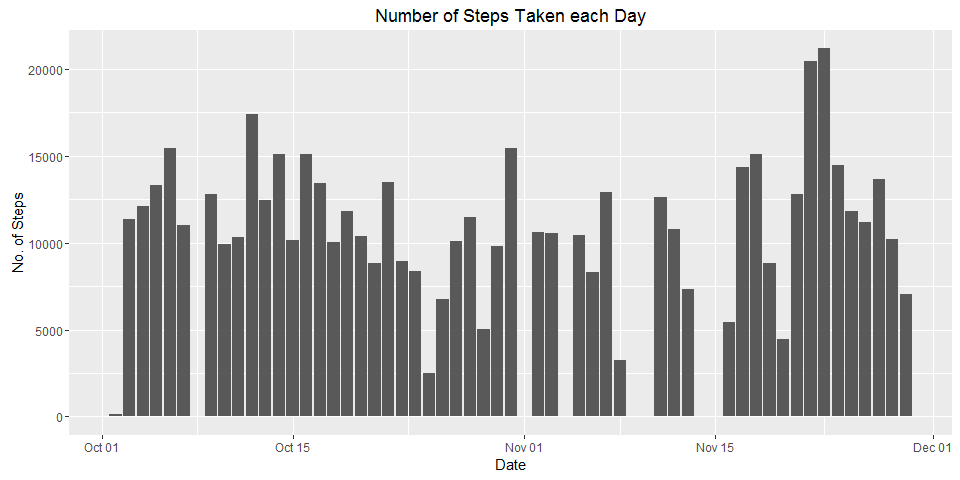

# Rep_Research_Assignment1
LB  
November 22, 2016  

Peer-Assessment 1
====================
Reproducible Research

Packages loaded for this project: dplyr, ggplot2, reshape2

```r
library(dplyr)
```

```
## 
## Attaching package: 'dplyr'
```

```
## The following objects are masked from 'package:stats':
## 
##     filter, lag
```

```
## The following objects are masked from 'package:base':
## 
##     intersect, setdiff, setequal, union
```

```r
library(ggplot2)
library(reshape2)
library(xtable)
```

```
## Warning: package 'xtable' was built under R version 3.3.2
```


Reading the data:

```r
knr <- read.csv('activity.csv', na.strings = '', stringsAsFactors = FALSE)
```

Process the data to use for histogam:

```r
filterNA <- filter(knr, steps != 'NA')
org.by.date <- aggregate(as.numeric(filterNA$steps), by = list(filterNA$date), sum)
org.by.date$Group.1 <- as.Date(org.by.date$Group.1)
org.by.date$x <- as.numeric(org.by.date$x)
```

This is a histogram of the total number of steps for each day.


```r
ggplot(org.by.date, aes(x)) + geom_histogram() + xlab('Number of Steps') + ylab('Count') + ggtitle('Frequency of No. of Steps')
```

```
## `stat_bin()` using `bins = 30`. Pick better value with `binwidth`.
```

<!-- -->

I have also included a figure showing how spread out it is by day.

```r
ggplot(org.by.date, aes(Group.1, x)) + geom_bar(stat= 'identity') + xlab('Date') + ylab('No. of Steps') + ggtitle('Number of Steps Taken each Day')
```

<!-- -->


```r
df <- data.frame(Property= c('Mean', 'Median'), Value= c(mean(as.numeric(org.by.date$x)), median(as.numeric(org.by.date$x))))
print(df)
```

```
##   Property    Value
## 1     Mean 10766.19
## 2   Median 10765.00
```


```r
part.three <- aggregate(x= as.numeric(filterNA$steps), by= list(as.factor(filterNA$interval)), mean)
plot(part.three$Group.1, part.three$x, type= 'l', main= 'Average Steps by Interval', ylab= 'Avg. No. of Steps', xlab= 'Interval')
lines(part.three$Group.1, part.three$x, lwd= 2)
```

<!-- -->

We can use the which.max function to see which 5-minute interval has the highest average amount of steps- the interval of 8:35.

```r
part.three[which.max(part.three$x),]
```

```
##     Group.1        x
## 104     835 206.1698
```

Let's see how many NA values are in this dataset using the dplyr function (since I read in the file with the na.strings setting to '', is.na was not appropriate here.)

```r
knr.na <- filter(knr, steps== 'NA')
length(knr.na$steps)
```

```
## [1] 2304
```

Let's see how these values could still be included in our analysis. I will use the average number of steps for each interval and insert them into the NA values for the same interval. Then I will combine the NA dataset with the dataset that had the NA values removed in order to have a complete dataset.


```r
r.comp <- NULL
missing.dates <- c("2012-10-01", "2012-10-08", "2012-11-01", "2012-11-04", "2012-11-09", "2012-11-10", "2012-11-14", "2012-11-30")
for (i in 1:length(missing.dates)){
  r.comp <- rbind(r.comp, part.three)
}
comb.vals <- cbind(r.comp, knr.na)
with.imp.values <- select(comb.vals, c(x, date, interval))
colnames(with.imp.values) <- c('steps', 'date', 'interval')
combined <- rbind(with.imp.values, filterNA)
org.by.date.two <- aggregate(as.numeric(combined$steps), by = list(combined$date), sum)
```


```r
ggplot(data= org.by.date.two, aes(x= x)) + geom_histogram() + xlab('Date') + ylab('No. of Steps') + ggtitle('Number of Steps Taken each Day')
```

```
## `stat_bin()` using `bins = 30`. Pick better value with `binwidth`.
```

<!-- -->


```r
ggplot(org.by.date.two, aes(x= as.Date(Group.1), y= x)) + geom_bar(stat= 'identity') + xlab('Date') + ylab('No. of Steps') + ggtitle('Number of Steps Taken each Day')
```

<!-- -->


```r
df.two <- data.frame(Property= c('Mean', 'Median'), Value= c(mean(as.numeric(org.by.date.two$x)), median(as.numeric(org.by.date.two$x))))
print(df.two)
```

```
##   Property    Value
## 1     Mean 10766.19
## 2   Median 10766.19
```

From these figures, we see that the mean and median do not change much. Since we inserted the average values from the existing data on steps to the complete dataset, the average and median should have remained similar. Therefore, imputing the missing values did not bias our results.

For the final part of the assignment, we will create a factor variable with two levels-- weekday and weekend.


```r
combined$date <- as.Date(combined$date)
class <- factor(ifelse(weekdays(combined$date) %in% c('Saturday', 'Sunday'), 'weekend', 'weekday'), levels = c('weekday', 'weekend'))
combined.factor <- cbind(combined, class)
plot.factor <- aggregate(as.numeric(combined.factor$steps), by=list(combined.factor$interval, combined.factor$class), mean)
df.three <- data.frame(plot.factor)
colnames(df.three) <- c('Interval', 'Class', 'Average.No.of.Steps')
gg <- ggplot(data= df.three, aes(x= Interval, y= Average.No.of.Steps))
gg + geom_jitter(alpha= 0.5, col= 'blue') + geom_line() + facet_grid(Class~.) 
```


Interestingly, we see that there is a difference in the average activity between weekdays and weekends. On weekdays, there is substantial activity from around intervals 500 to 1000 and activity is more subdued until 1900. On weekends, activity is also elevated from 800 to 1000, but not as elevated as weekdays. Activity is also consistently higher during the afternoon and early evening hours than the corresponding times on weekdays.
